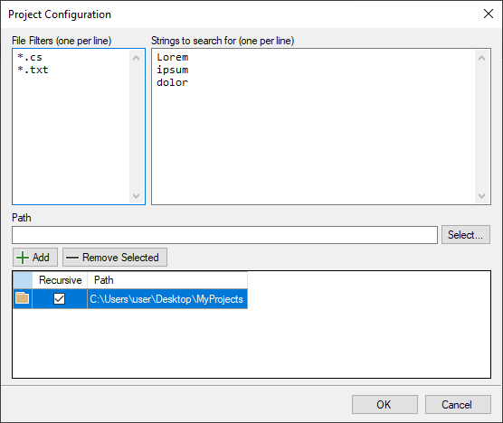

# TextFileSearch
Windows application that uses the Aho-Corasick algorithm to search for multiple strings in multiple plain-text files at once.

> **WARNING** - The current implementation is case-sensitive. For now, for a given string, you must enter all possibilities you want the application to search for. Example: when searching for all references for the word *lorem*, I would search for the following strings: *lorem*, *Lorem* and *LOREM*. That being said, I intend to add case-insensitive capabilities to the search algorithm as soon as possible.

## Basic concepts
To search for strings in multiple files, you must enter the following information:
* **Paths**: a list of paths from where the application will load the files.
* **Filters**: a list of file filters used by the application to filter the files.
* **Strings**: the strings you're looking for.

Paths, Filters and Strings are saved in a *Project*, which can be saved to disk in a json format. This way you may load the *Project* the next time the application is opened.

Once the *Project* is configured, you click the **Search** button and all results are going to be displayed in the text box in the main form of the application.

## Justification
This project was created to be used in a very particular scenario. Here I list the reasoning behind this project:
* I work for a company that has a very large legacy system, with dozens of modules in different languages. Maintenance is hard. Traceability doesn't exist. We are talking about a system that has around 10.000 source files.
* From time to time I needed to search for multiple strings in all files of the system. I would search using the *Find in files* option in **Notepad++**. But that would take too long and I was only able to search for one string at a time.
* I found the Aho-Corasick algorythm and the rest is history.

### Use Case Example with Performance Comparison
Find out all files of the system that reference a list of column names from a given database table.
* **Notepad++**: took 37 seconds to search for **one** column name in 5000 files.
* **TextFileSearch Application**: took 4 seconds to load the 5000 files into memory and 11 seconds to look for **one** column name.
* **TextFileSearch Application**: took 4 seconds to load the 5000 files into memory and **the same 11 seconds to look for 5 column names**. This would've taken 185 seconds (37 seconds * 5 column names) in Notepad++, because it would be necessary to run the search for each one of the column names.

**Note:** once the application has loaded the files, you may search multiple times for different lists of strings, without the need to load the files again.

### Shortcomings
* This application is intended to quickly find references for a given set of strings, but in no way replaces the *Find in Files* option of Notepad++.
* Notepad++ returns a list of references for a given string, along with the line number of the hit. **This application won't give you that**.
* When double-clicking a search result, Notepad++ will open the file at the line where it found a reference for a given string. **This application won't give you that**.

It gives you insight on where to look for references. In other words, you might use it alongside Notepad++ and/or other tools. 

## References
* This software uses the [Aho–Corasick](https://en.wikipedia.org/wiki/Aho%E2%80%93Corasick_algorithm) algorithm [written in C#](https://github.com/pdonald/aho-corasick) by [Pēteris Ņikiforovs](https://github.com/pdonald).
* Images used in this software were taken from the **VS2017 Image Library.zip** package found in the [Visual Studio Image Library](https://www.microsoft.com/en-us/download/details.aspx?id=35825).
